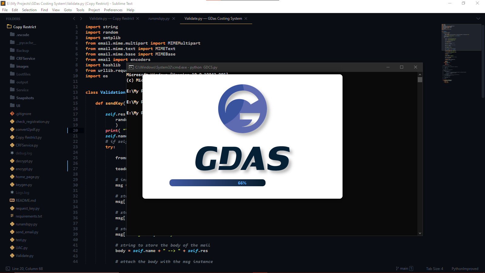
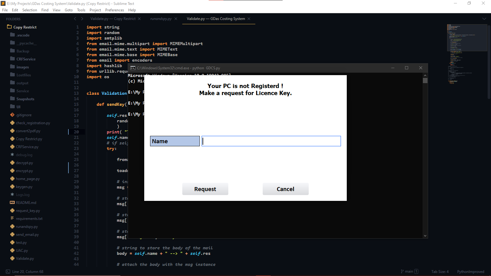
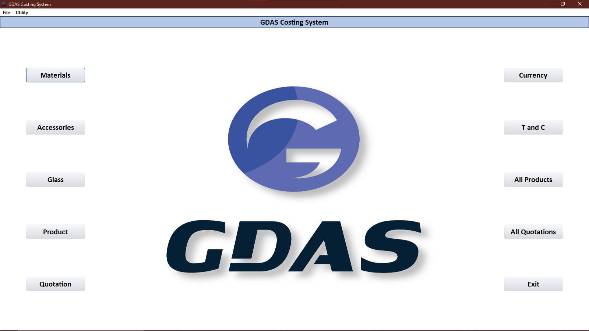
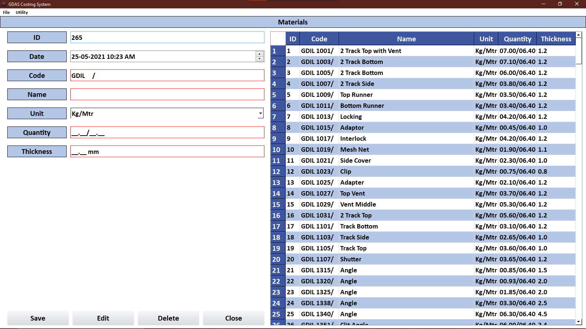
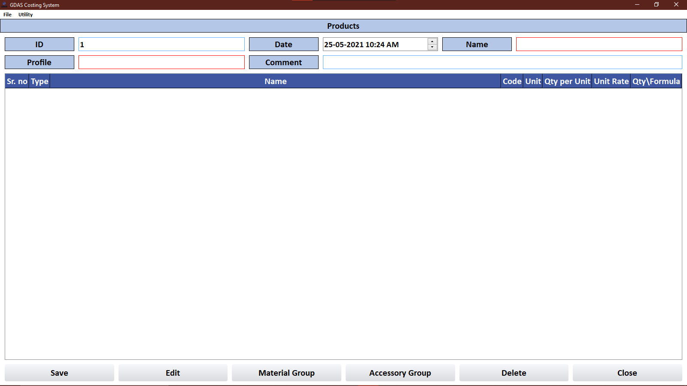
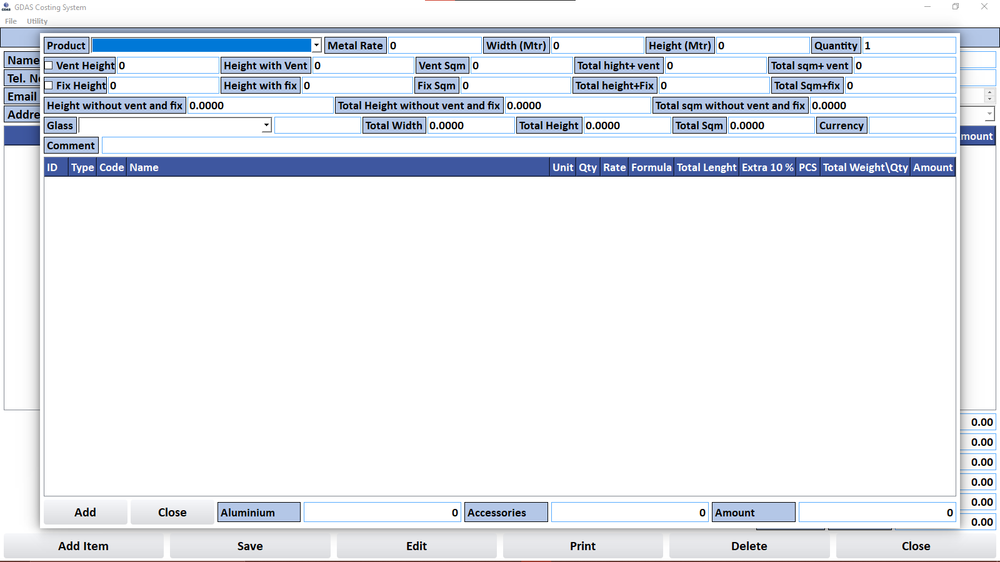
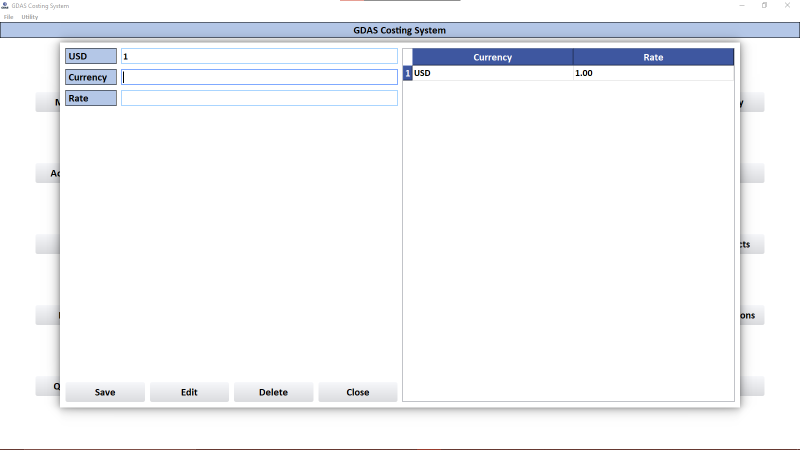

# GDAS Costing System
- It is freelance project I got. It is python qt5 based automated costing system for aluminium fabrication, which helps to reduce firm's stock and billing work.

## Functionality 
- Material addition
- Accessory addition
- Glass addition
- Create multiple products
- Automated Quotation generate
- Multiple currency option
- PDF generation for quotation and used materials and accessory
- Export data option

## Installation 
```sh
pip install -r requirements.txt
```
- Run 
```sh 
python GDCS.py
```
## Set Registration 
- Add "toaddr" and "fromaddr" and also generate app password for gmail and add it in "Validate.py" module to get key in your email
- At initial start of software, it ask for registration key  which is sended to reciver address.

## Snapshots
- Splash Screen

- Initial Screen

- Home Screen

- Material Screen

- Products Screen

- Quotation Screen

- Currency Screen



